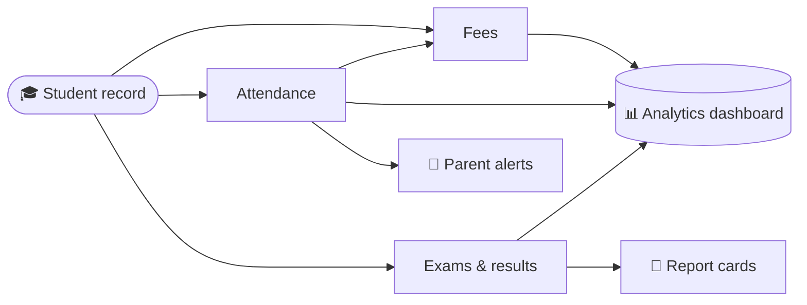

<!-- ========================= HEADER ========================= -->

  

  

  
  
  
  

  
  
  
  
  

---

## 👋 About Me

I'm a **mathematics graduate turned developer**. I build backend and frontend systems for real products, and my main project is **[School Office](https://www.schooloffice.tech)**, a school management ERP that brings admissions, attendance, fees, exams and results into one dashboard.

I like taking messy manual work (attendance registers, fee ledgers, result tallying) and turning it into software that a school office can actually run on.

|  |  |
| :-- | :-- |
| 💼 **Role** | Freelance Full-Stack Developer · Founder, School Office |
| 🏫 **Building** | An 11-module School ERP (founded 2025, Ajmer, Rajasthan) |
| 🛠️ **Core stack** | Node.js · Express · MySQL / PostgreSQL · React + TypeScript |
| 🎓 **Background** | M.Sc. Mathematics (University of Delhi) · B.Ed. (NCERT) |
| 📫 **Reach me** | [Head@schooloffice.tech](mailto:Head@schooloffice.tech) |

---

## 🧰 Tech Stack

  

  
  
  
  
  

---

## 🏫 Featured Project: School Office

> **One school office, running on one screen.**
> A single dashboard that replaces registers, spreadsheets and separate apps for school administration. Product built and ready, now onboarding its first schools.

  
  
  

### 📦 11 integrated modules

| 🎓 Academics | 💰 Operations | 📣 Engagement |
| :-- | :-- | :-- |
| Student directory | Fee management | Communication hub (SMS, email, app alerts) |
| Attendance | Staff HR & payroll | E-learning / LMS |
| Online exams (CBT) | Transport | Homework |
| Paper generator | Analytics | |

### 🔗 One record, everywhere

### ✨ Highlights

- **No re-entry:** attendance flows into fees and alerts, and exam results roll straight into report cards.
- **Role-based logins:** teachers, accountants and the principal each see only what is relevant to them.
- **Parent communication:** Node.js backend with WhatsApp API integration.
- **Built end to end:** backend services, admin panel and product website, all by one developer.
- **Registered business:** Micro (MSME) enterprise, founded 2025 in Ajmer, Rajasthan.

---

## 📊 GitHub Stats

  
  

### 🏫 School Office repositories

| Repository | Last commit | Commits (past year) | Main language | Size |
| :-- | :--: | :--: | :--: | :--: |

| [**schoolOfficeAdminFront**](https://github.com/Muniramm890/schoolOfficeAdminFront) |  |  |  |  |
| [**SchoolOffice** (website)](https://github.com/Muniramm890/SchoolOffice) |  |  |  |  |

| [**schoolOfficeAdminFront**](https://github.com/Muniramm890/SCHOOL-ERP-backend) |  |  |  |  |

  
  

  

  

---

## 🎓 Education

| Degree | Institution |
| :-- | :-- |
| **M.Sc. Mathematics** | Hindu College, University of Delhi |
| **B.Ed. Science & Mathematics** | Regional Institute of Education (RIE) Ajmer, NCERT New Delhi |
| **B.Sc. Mathematics** | SBN College, University of Rajasthan |

---

## 🤝 Let's Work Together

I take on freelance **backend, frontend and full-stack** projects, especially school and education software, dashboards and automation.

  
  
  

  

